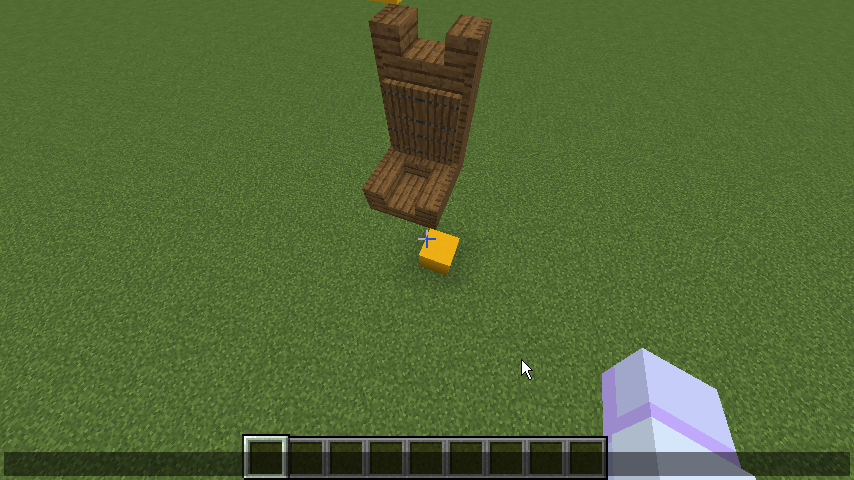
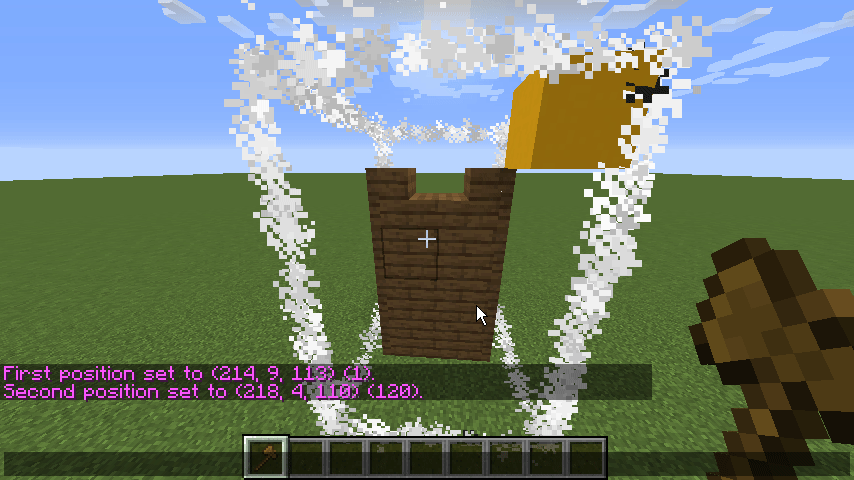

# Selecting an area

One of the most basic, yet most used functions of WorldEdit is selecting and setting a cube shaped area.

### Getting your wand tool

The first step to selecting a cube shaped area is getting your wand tool, which is the **Wooden Axe**. You can get this tool by either reaching into your creative inventory and taking the wooden axe from there, or by typing **//wand** in chat.

### Method 1: Clicking

The simplest way to select an area using WorldEdit is by left and right clicking. Left clicking sets the first position, right clicking sets the second.

**NOTE: If you don't have the WorldEditSUI plugin installed you will not see your selection visualised like in our screen captures.**

### Method 2: //pos1 and //pos2

Another easy way of selecting an area is by typing the commands **//pos1** and **//pos2** in chat \(no spaces\). This will put the chosen position \(1 or 2\) at the location of the players feet.

### Method 3: //hpos1 and //hpos2

The commands **//hpos1** and **//hpos2** allow you to select an area based on which block you are pointing at with your cursor.

### Deselecting

If you want to clear your selection, simply type **//desel** or **//sel** in chat.

